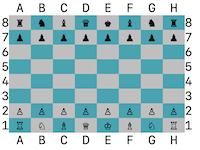

# ♛ Chess Game 

Welcome to the Chess Game project! This command-line chess game is built using Ruby and adheres to SOLID object-oriented design principles. It allows players to enjoy classic chess gameplay with features like move validation, castling, and more. This project served as the final assignment for the Ruby course in [The Odin Project](https://www.theodinproject.com). 



## Features

- Implementation of chess rules, including:
  - Accurate move validation for all pieces
  - Restrictions on moves that would expose the player to check 
  - Special moves like castling and pawn promotion
  - Detection of check and checkmate
- Command-line interface with clear instructions
- Ability to save and load games using YAML
- Modular and maintainable code following SOLID principles
- Thoroughly tested using RSpec

## Design Decisions

In developing this Chess Game, I aimed to adhere to SOLID object-oriented design principles to create a maintainable and flexible codebase. These principles guided the interaction between classes, ensuring each has a clear purpose and can be extended without causing issues.

However, I also prioritized making the code easy to read and understand. At times, this meant opting for simplicity and clarity over strict adherence to SOLID principles. For example, I made design choices for the `#generate_moves` method in the piece subclasses where readability took precedence. My goal was to ensure the code remains accessible to developers, even those not deeply familiar with SOLID principles.

Specifically, this approach involved:

- **Prioritizing Clear Method and Class Names**: I selected descriptive names for methods and classes to make their purposes immediately clear, even if it resulted in slightly longer names.
- **Limiting Abstraction**: While abstraction is useful, excessive abstraction can lead to confusion. I aimed for a balance, using abstraction where it added value but avoiding it when it obscured the code's intent.
- **Maintaining Method Simplicity**: I kept methods concise and focused on a single task but avoided overly granular breakdowns that might complicate understanding the overall flow.

By prioritizing readability, I hope this project demonstrates how to balance design principles with practical considerations, making the codebase both accessible and maintainable.

## Installation

To get started with the Chess Game, follow these steps:

1. **Clone the repository**:

    ```bash
    git clone https://github.com/carisaelam/odin-chess
    ```

2. **Navigate to the project directory**:

    ```bash
    cd odin-chess
    ```

3. **Install dependencies**:

    Ensure you have Ruby installed. Then, install the necessary gems:

    ```bash
    bundle install
    ```

## Usage

To play the game, run the following command:

```bash
ruby main.rb
```

Follow the on-screen prompts to make moves. Players can use standard chess notation (e.g., `e2 to e4`) to input their moves.


### Enjoy the game!